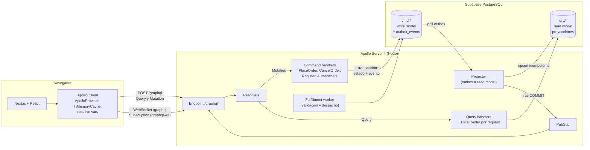
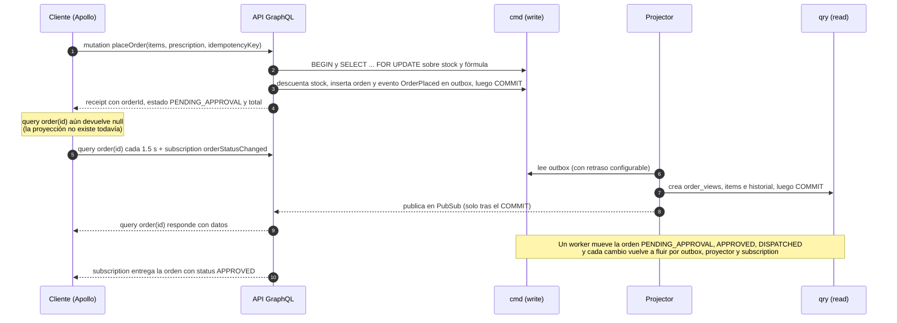

# Afirmative Pill

Plataforma de e-commerce farmacéutico con **GraphQL de extremo a extremo (Zero-REST)** y arquitectura **CQRS**.
Taller Práctico Avanzado, Universidad de La Sabana.

| Capa | Tecnología |
|---|---|
| API | Apollo Server 4 (Node 22, TypeScript) + Express, WebSocket `graphql-ws` para Subscriptions |
| Cliente | Next.js 15 (App Router) + React 19 + Apollo Client 3 (`ApolloProvider`, hooks, caché normalizado) |
| Persistencia | PostgreSQL en **Supabase** (schemas `cmd` = escritura, `qry` = lectura) |
| Empaquetado | Docker Compose: `docker compose up --build` levanta API y frontend |

---

## 1. Inicio rápido

**Requisitos:** Docker con Compose v2 y un proyecto de Supabase.

```bash
# 1) Configura variables
cp .env.example .env
#    - DATABASE_URL: Supabase > Project Settings > Database > Connection string > "Session pooler"
#    - JWT_SECRET:   openssl rand -hex 32

# 2) Levanta todo
docker compose up --build
```

- Frontend: <http://localhost:3000>
- API GraphQL + Apollo Sandbox: <http://localhost:4000/graphql>

En el **primer arranque** el backend, de forma idempotente: aplica las migraciones (schemas `cmd`/`qry`), carga los **50 medicamentos** del dataset (27 requieren fórmula, 14 categorías, 16 laboratorios) y construye la proyección de catálogo. No hay que ejecutar SQL a mano.

---

## 2. Arquitectura



### Flujo de un pedido (y la consistencia eventual)


 
---

## 3. Cómo se cumple cada criterio de la rúbrica

| Criterio (peso) | Evidencia en este repo |
|---|---|
| **Diseño GraphQL (40 %)** | SDL documentado en [`backend/schema.graphql`](backend/schema.graphql) (sección 4): scalars propios validados (`UUID`, `Date`, `DateTime`, `Money`), enums, inputs, paginación Relay por cursor, payloads con `errors` tipados. **N+1 resuelto con DataLoader** (sección 6) con log de lotes. **Zero-REST:** el frontend solo habla con `/graphql` (HTTP y WebSocket); el healthcheck de Docker también usa una query GraphQL. |
| **Arquitectura CQRS (25 %)** | `src/commands/*` (escritura) y `src/queries/*` + `src/projections/*` (lectura) sin dependencias cruzadas; dos schemas de base de datos distintos; invariantes protegidas en el comando (sección 5); **outbox transaccional** y proyector con estrategia explícita de consistencia eventual (sección 5.3). |
| **Frontend Apollo Client (20 %)** | `ApolloProvider` en la raíz (`components/ApolloWrapper.tsx`), `useQuery`/`useMutation`/`useSubscription`, `InMemoryCache` con `typePolicies` y `relayStylePagination`, actualización de caché tras la mutation (`cache.modify`, `cache.evict`), reactive variables para sesión y carrito. |
| **Supabase y documentación (15 %)** | Migraciones SQL versionadas en `backend/db/migrations`, seed de 50 medicamentos, este README, `schema.graphql`, justificación de CQRS y de N+1. |

---

## 4. Contrato GraphQL (`schema.graphql`)

Decisiones de diseño principales:

- **La segregación CQRS es visible en el contrato:** `Query` = modelos de lectura, `Mutation` = comandos con intención de negocio (`placeOrder`, `cancelOrder`), `Subscription` = notificaciones de lo ya proyectado.
- **Errores de dominio como datos, no como excepciones.** Las reglas de negocio devuelven `errors: [DomainError!]!` con `code` (enum), `field` y contexto (`requested`/`available`). Los errores de transporte (sin sesión) usan `extensions.code = UNAUTHENTICATED`.
- **Un solo tipo `Medication`** sirve la vista condensada (tarjeta) y la ficha completa: el cliente elige campos (sin over-fetching), y no hay tipos duplicados.
- **Paginación por cursor (keyset)** sobre `(nombre|precio, id)`, estable ante cambios y apoyada en índices. `totalCount` solo se calcula si se pide.
- **Facetas** (`catalogFacets`) con conteos por categoría; la faceta de categoría ignora su propio filtro (facetado disyuntivo).
- **Idempotencia** del comando `placeOrder` con `idempotencyKey`.

```graphql
# ════════════════════════════════════════════════════════════════════
# Afirmative Pill · Schema SDL
# Canal único cliente-servidor (Zero-REST). Segregación CQRS visible en el contrato:
#   · type Query        -> modelos de lectura (proyecciones optimizadas)
#   · type Mutation     -> comandos que expresan intención de negocio
#   · type Subscription -> notificaciones de los cambios ya proyectados
# ════════════════════════════════════════════════════════════════════

"Fecha y hora ISO-8601 en UTC (p. ej. 2026-09-19T14:30:00.000Z)."
scalar DateTime

"Fecha calendario ISO-8601 sin zona horaria (YYYY-MM-DD)."
scalar Date

"Valor monetario en pesos colombianos (COP) con hasta dos decimales."
scalar Money

"Identificador UUID en formato canónico."
scalar UUID

# ─────────────────────────── Enums ───────────────────────────

"Estado operacional de una orden."
enum OrderStatus {
  "Recibida; a la espera de validación (y de revisión de fórmula médica si aplica)."
  PENDING_APPROVAL
  "Validada por la farmacia; inventario reservado y lista para despachar."
  APPROVED
  "Entregada al operador logístico."
  DISPATCHED
  "Cancelada por el paciente o rechazada en la validación; el inventario se libera."
  CANCELLED
}

enum StockStatus {
  IN_STOCK
  LOW_STOCK
  OUT_OF_STOCK
}

enum MedicationSort {
  NAME_ASC
  PRICE_ASC
  PRICE_DESC
}

"Códigos de error de dominio devueltos dentro de los payloads de las mutations."
enum ErrorCode {
  VALIDATION_ERROR
  EMAIL_TAKEN
  INVALID_CREDENTIALS
  MEDICATION_NOT_FOUND
  INSUFFICIENT_STOCK
  PRESCRIPTION_REQUIRED
  PRESCRIPTION_INVALID
  ORDER_NOT_FOUND
  INVALID_STATE_TRANSITION
}

# ─────────────────── Modelo de lectura: catálogo ───────────────────

type Category {
  id: ID!
  name: String!
  slug: String!
}

type Laboratory {
  id: ID!
  name: String!
}

"Ficha de medicamento. El cliente selecciona solo los campos que necesita (vista condensada o ficha completa)."
type Medication {
  id: ID!
  sku: String!
  name: String!
  activeIngredient: String!
  dosage: String!
  presentation: String!
  price: Money!
  description: String!
  requiresPrescription: Boolean!
  stockStatus: StockStatus!
  "Unidades disponibles según la proyección (eventualmente consistente con el inventario real)."
  availableStock: Int!
  "Resuelto por lotes con DataLoader (sin N+1)."
  category: Category!
  "Resuelto por lotes con DataLoader (sin N+1)."
  laboratory: Laboratory!
  updatedAt: DateTime!
}

input MedicationFilter {
  "Texto libre sobre nombre comercial, principio activo, categoría y laboratorio (sin tildes ni mayúsculas)."
  search: String
  "Nombre comercial."
  name: String
  "Principio activo."
  activeIngredient: String
  "Categorías terapéuticas (OR entre ellas)."
  categoryIds: [ID!]
  requiresPrescription: Boolean
  inStockOnly: Boolean
}

type PageInfo {
  hasNextPage: Boolean!
  hasPreviousPage: Boolean!
  startCursor: String
  endCursor: String
}

type MedicationEdge {
  cursor: String!
  node: Medication!
}

type MedicationConnection {
  edges: [MedicationEdge!]!
  pageInfo: PageInfo!
  "Solo se calcula si el cliente lo solicita."
  totalCount: Int!
}

type CategoryFacet {
  category: Category!
  count: Int!
}

"Facetas de búsqueda (conteos por categoría y por requisito de fórmula) para el filtro actual."
type CatalogFacets {
  categories: [CategoryFacet!]!
  prescriptionRequired: Int!
  overTheCounter: Int!
}

# ─────────────────── Modelo de lectura: órdenes ───────────────────

type OrderItem {
  medicationId: ID!
  medicationName: String!
  quantity: Int!
  unitPrice: Money!
  lineTotal: Money!
  "Medicamento actual del catálogo (DataLoader por lote)."
  medication: Medication
}

type Prescription {
  prescriptionNumber: String!
  doctorName: String!
  doctorLicense: String!
  issuedAt: Date!
}

type StatusChange {
  status: OrderStatus!
  reason: String
  occurredAt: DateTime!
}

"Proyección de la orden optimizada para lectura."
type Order {
  id: UUID!
  status: OrderStatus!
  total: Money!
  itemCount: Int!
  requiresPrescription: Boolean!
  cancelReason: String
  placedAt: DateTime!
  updatedAt: DateTime!
  items: [OrderItem!]!
  prescription: Prescription
  statusHistory: [StatusChange!]!
}

type OrderEdge {
  cursor: String!
  node: Order!
}

type OrderConnection {
  edges: [OrderEdge!]!
  pageInfo: PageInfo!
}

# ─────────────────────── Identidad ───────────────────────

type User {
  id: UUID!
  email: String!
  fullName: String!
}

# ──────────────── Errores de dominio y payloads ────────────────

"Error de validación o de regla de negocio. Las mutations lo devuelven en `errors` en lugar de lanzar excepciones."
type DomainError {
  code: ErrorCode!
  message: String!
  "Ruta del campo del input afectado (p. ej. prescription.doctorLicense)."
  field: String
  medicationId: ID
  requested: Int
  available: Int
}

type AuthPayload {
  token: String
  user: User
  errors: [DomainError!]!
}

"Acuse del comando. La proyección de la orden puede tardar unos instantes en estar disponible (consistencia eventual)."
type OrderReceipt {
  orderId: UUID!
  status: OrderStatus!
  total: Money!
  itemCount: Int!
  requiresPrescription: Boolean!
  placedAt: DateTime!
}

type PlaceOrderPayload {
  receipt: OrderReceipt
  errors: [DomainError!]!
}

type CancelOrderPayload {
  receipt: OrderReceipt
  errors: [DomainError!]!
}

# ───────────────────────── Inputs ─────────────────────────

input RegisterInput {
  email: String!
  fullName: String!
  password: String!
}

input LoginInput {
  email: String!
  password: String!
}

input OrderItemInput {
  medicationId: ID!
  quantity: Int!
}

"Soporte de la fórmula médica. Obligatorio si algún ítem tiene requiresPrescription = true."
input PrescriptionInput {
  prescriptionNumber: String!
  doctorName: String!
  doctorLicense: String!
  issuedAt: Date!
  notes: String
}

input PlaceOrderInput {
  items: [OrderItemInput!]!
  prescription: PrescriptionInput
  "Clave de idempotencia: reintentar con la misma clave no duplica la orden ni el descuento de stock."
  idempotencyKey: String
}

input CancelOrderInput {
  orderId: UUID!
  reason: String
}

# ─────────────────── Operaciones raíz ───────────────────

type Query {
  "Paciente autenticado (claims del JWT) o null."
  me: User

  "Búsqueda facetada de medicamentos con paginación por cursor (keyset)."
  medications(
    filter: MedicationFilter
    sort: MedicationSort = NAME_ASC
    first: Int = 12
    after: String
  ): MedicationConnection!

  "Ficha detallada de un medicamento."
  medication(id: ID!): Medication

  "Conteos por categoría y requisito de fórmula (la faceta de categoría ignora su propio filtro)."
  catalogFacets(filter: MedicationFilter): CatalogFacets!

  "Proyección de una orden del paciente autenticado. Devuelve null si aún no se proyectó o no existe."
  order(id: UUID!): Order

  "Órdenes del paciente autenticado, de la más reciente a la más antigua."
  myOrders(first: Int = 10, after: String): OrderConnection!
}

type Mutation {
  "Comando: registrar un paciente."
  register(input: RegisterInput!): AuthPayload!

  "Comando: iniciar sesión."
  login(input: LoginInput!): AuthPayload!

  "Comando: emitir un pedido. Valida fórmula médica y stock, reserva inventario de forma atómica."
  placeOrder(input: PlaceOrderInput!): PlaceOrderPayload!

  "Comando: cancelar un pedido (solo PENDING_APPROVAL o APPROVED). Libera el inventario reservado."
  cancelOrder(input: CancelOrderInput!): CancelOrderPayload!
}

type Subscription {
  "Emite la proyección actualizada de la orden cada vez que cambia su estado."
  orderStatusChanged(orderId: UUID!): Order!
}
```

---

## 5. CQRS

### 5.1 Lado de comandos (write model, schema `cmd`)

Cada mutation delega en un *command handler* que expresa una intención de negocio y protege invariantes dentro de **una transacción**:

`PlaceOrder` (`backend/src/commands/placeOrder.ts`)

1. Valida el input con Zod (máx. 20 líneas, 1 a 10 unidades por línea, formatos de fórmula).
2. Bloquea las filas de `cmd.medications` con `SELECT ... FOR UPDATE` **ordenadas por id** (sin deadlocks entre pedidos concurrentes).
3. Invariantes: el medicamento existe; **hay stock suficiente**; si algún ítem tiene `requires_prescription = true`, **debe llegar el soporte de la fórmula** (número, médico, registro, fecha válida y no mayor a 60 días).
4. Recalcula el total **en el servidor** con los precios de la base de datos (nunca confía en el cliente) y en centavos enteros.
5. Inserta orden, ítems y fórmula; descuenta stock con `UPDATE ... WHERE stock >= n`; `CHECK (stock >= 0)` queda como última red de seguridad.
6. Escribe los eventos (`OrderPlaced`, `StockChanged`) en `cmd.outbox_events` **en la misma transacción** (*transactional outbox*: no hay dual-write).
7. Devuelve todos los errores juntos (stock de varios ítems + fórmula faltante), sin cambiar nada.

Otras piezas: máquina de estados de la orden (`PENDING_APPROVAL → APPROVED → DISPATCHED`, y cancelación desde los dos primeros), **compensación** al cancelar (devuelve el stock y emite `StockChanged`), `CancelOrder` con verificación de propiedad, `Register`/`Authenticate` con bcrypt y JWT (comparación de tiempo constante frente a enumeración de correos).

Además: si el pedido no exige fórmula, cualquier fórmula enviada **no se almacena** (minimización de datos de salud).

### 5.2 Lado de consultas (read model, schema `qry`)

Los resolvers de `Query` **solo leen de `qry.*`**, tablas desnormalizadas y con índices para lectura: `qry.medications` (categoría y laboratorio como dimensiones, texto normalizado sin tildes con índices trigram GIN, estado de stock precalculado), `qry.order_views`, `qry.order_item_views`, `qry.order_status_history`, `qry.prescription_views`.

El catálogo se proyecta desde el write model en el primer arranque; esto demuestra que el read model es **reconstruible** desde la fuente de verdad.

### 5.3 Consistencia eventual: qué ve el usuario

| Momento | Write model | Read model | Experiencia del usuario |
|---|---|---|---|
| `placeOrder` responde | Orden creada, stock descontado | Orden **aún no proyectada** | La UI recibe el `receipt` (id, total, estado) y muestra "Recibimos tu pedido" con un indicador de sincronización |
| Hasta `PROJECTION_DELAY_MS` (1.5 s por defecto, retraso deliberado para hacerlo visible) | Estable | `Query.order` devuelve `null` | La página consulta cada 1.5 s (`startPolling`); nunca muestra un error |
| El proyector confirma | Estable | Orden proyectada; **después del COMMIT** se publica en la Subscription | Aparecen detalle y línea de tiempo; el sondeo se detiene y las Subscriptions toman el relevo |
| Stock de otros usuarios | Descontado al instante | Se actualiza al proyectar | El catálogo puede mostrar existencias con un instante de desfase; **el comando siempre valida contra el write model**, así que nunca se vende de más |

Garantías del proyector: un único proyector activo (advisory lock transaccional, orden estricto por id), aplicación **idempotente** (`ON CONFLICT` y guardas `last_event_id`), y notificaciones solo después del COMMIT (los suscriptores no ven nada que aún no se pueda consultar).

En el cliente, tras la mutation se actualiza el caché de Apollo (`cache.modify` descuenta el stock en las fichas ya cacheadas y `cache.evict` invalida "Mis pedidos"), sin recargar.

---

## 6. N+1 y DataLoader

**Problema:** una consulta como

```graphql
{ medications(first: 12) { edges { node { name category { name } laboratory { name } } } } }
```

resuelta ingenuamente ejecutaría 1 query de medicamentos + 12 de categorías + 12 de laboratorios = **25 queries**.

**Solución:** todos los resolvers anidados (`Medication.category`, `Medication.laboratory`, `CategoryFacet.category`, `Order.items`, `Order.prescription`, `Order.statusHistory`, `OrderItem.medication`) pasan por `DataLoader` (`backend/src/graphql/loaders.ts`). Cada loader agrupa las claves del mismo *tick* y emite **una sola consulta** `WHERE id = ANY($1)`: la consulta anterior queda en **3 queries**. Los loaders se crean **por request** (y se renuevan por evento en las Subscriptions), así el caché nunca se comparte entre usuarios ni sirve datos viejos.

**Evidencia en los logs** (`docker compose logs -f backend`, ejemplo):

```
INFO  [graphql] query CatalogList ...
SQL   [sql] 1.8ms rows=12 SELECT m.* FROM qry.medications m ORDER BY m.name ASC, m.id ASC LIMIT $1 -- [13]
INFO  [dataloader] categoryById: 12 load() -> 1 consulta SQL (9 claves únicas)
SQL   [sql] 0.9ms rows=9 SELECT id, name, slug FROM qry.categories WHERE id = ANY($1::int[]) -- [[1,2,3,...]]
INFO  [dataloader] laboratoryById: 12 load() -> 1 consulta SQL (8 claves únicas)
SQL   [sql] 0.8ms rows=8 SELECT id, name FROM qry.laboratories WHERE id = ANY($1::int[]) -- [[...]]
```

`LOG_SQL=true` (por defecto) imprime cada SQL; el mensaje `[dataloader]` cuenta cuántos `load()` se fusionaron en cada consulta.

---

## 7. Frontend (Apollo Client)

- **`ApolloProvider`** en el layout raíz; un único `ApolloClient` con `split`: HTTP para Query/Mutation y `GraphQLWsLink` para Subscriptions. Cabecera `Authorization: Bearer` mediante `setContext`; una respuesta `UNAUTHENTICATED` limpia la sesión.
- **Hooks:** `useQuery` (catálogo, facetas, detalle, pedidos), `useMutation` (registro, login, `placeOrder`, `cancelOrder`), `useSubscription` (estado de la orden), `useReactiveVar` (sesión y carrito).
- **Caché:** `relayStylePagination` para "Mostrar más" con `fetchMore`; entidades normalizadas por `id` (la Subscription devuelve un `Order` y la UI se actualiza sola); `update` de la mutation con `cache.modify`/`evict`.
- **Sin over-fetching:** cada pantalla declara solo los campos que dibuja (la tarjeta del catálogo no pide descripción ni laboratorio).
- **Carrito:** estado de cliente (reactive variable persistida en `localStorage`); el servidor conoce el pedido cuando se emite el comando `placeOrder`.

---

## 8. Video demostrativo


---

## 9. Estructura del repositorio

```
.
├── docker-compose.yml          # backend + frontend (la BD es Supabase)
├── .env.example
├── backend/
│   ├── schema.graphql          # contrato SDL
│   ├── db/migrations/          # 001 write model, 002 read model, 003 seed (50 medicamentos)
│   ├── db/seed/medications.csv # dataset
│   └── src/
│       ├── commands/           # LADO DE ESCRITURA (PlaceOrder, ciclo de vida, auth, outbox)
│       ├── queries/            # LADO DE LECTURA (catálogo, órdenes)
│       ├── projections/        # proyector outbox -> qry.*
│       ├── workers/            # process manager de fulfillment
│       └── graphql/            # scalars, DataLoaders, resolvers
└── frontend/
    └── src/{app,components,lib}
```

## 10. Decisiones y límites

- **Fulfillment simulado:** la "validación farmacéutica" y el despacho los simula un worker durable (guiado por `transition_due_at`). Tiempos configurables con `REVIEW_DELAY_MS` y `DISPATCH_DELAY_MS`. Un número de fórmula que empieza por `REJ` se rechaza (convención solo de demostración).
- **PubSub en memoria:** suficiente para una instancia de API. Para varias réplicas se sustituye por Redis (`graphql-redis-subscriptions`) sin tocar los resolvers.
- **Pagos** y **despacho real** quedan fuera del alcance del taller.
- **`typescript.ignoreBuildErrors`** está activo en `frontend/next.config.mjs` para que la imagen siempre construya; usa `npm run typecheck` en `frontend/` y `backend/` para validar tipos.
- **Sin lockfile:** las imágenes usan `npm install`; genera `package-lock.json` (`npm install` local) y cámbialo a `npm ci` si necesitas builds reproducibles.
- **Apollo Server 4:** se eligió la versión con la integración Express incluida; migrar a la 5 solo cambia el paquete de integración.

## 11. Solución de problemas

| Síntoma | Causa probable |
|---|---|
| `backend` reintenta y termina con `ENETUNREACH` / `ENOTFOUND` | Usa el **Session pooler** de Supabase en `DATABASE_URL`. |
| `password authentication failed` | Contraseña incorrecta o sin URL-encode de caracteres especiales. |
| `docker compose up` falla con "Falta DATABASE_URL" | No existe `.env` (cópialo desde `.env.example`). |
| El frontend carga pero las llamadas fallan por CORS | `FRONTEND_ORIGIN` debe coincidir con el origen del navegador. |
| Cambiaste el puerto/host del backend | Reconstruye el frontend (`docker compose build frontend`): las URLs `NEXT_PUBLIC_*` se incrustan al compilar. |
